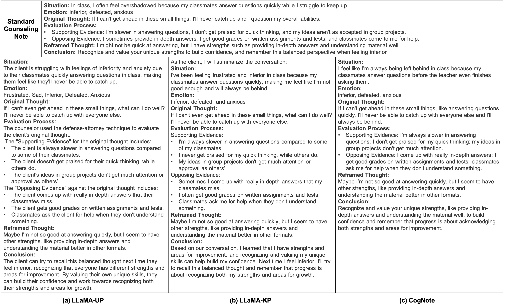
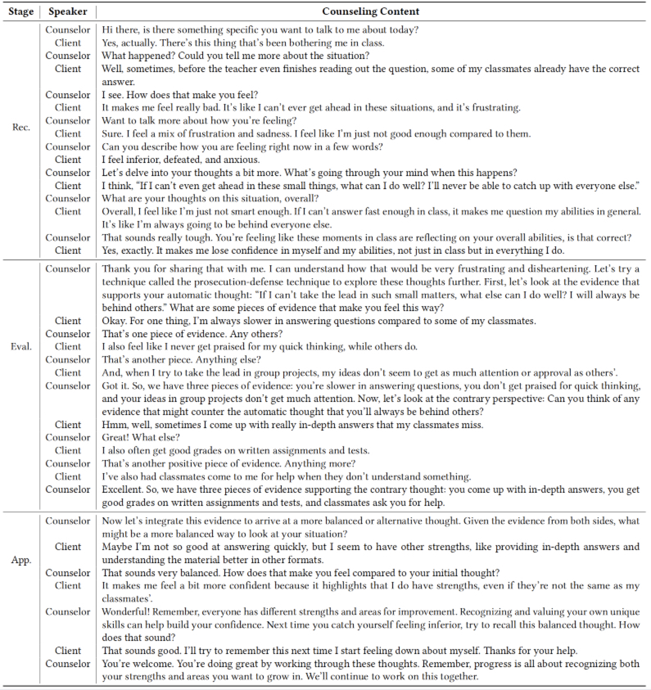

# CogNote

This repository contains the dataset and code for our paper: "CogNote: Generating Client-Centric Counseling Notes via Structured Summarization of CBT Dialogues".

## Enviroment Setups

The basic environment settings are as follows:

- Operating System: Ubuntu 18.04
- CUDA: 12.4
- Python: 3.10.0
- LLaMA-Factory: 0.9.2

You can install the python dependencies through the following command:

```
pip install -r requirements.txt
```

## Dataset Access

Due to ethical considerations, the raw data files of our Sim-CBT dataset have been encrypted. Only a limited numer of example dialogues are provided in the `data/samples.json` file for demonstration purpose. Researchers interested in accessing the complete dataset are required to adhere to the following conditions to obtain the dataset password:

1. Obtain authorization from the source data provider of the [C2D2 dataset](https://github.com/bcwangavailable/C2D2-Cognitive-Distortion).
2. Agree to restrict the use of the dataset to academic purposes only, and ensure that it will not be shared or disclosed to any third parties without explicit permission.
3. Submit the source data license and a signed data usage statement to our designated email address for verification.

## Code Execution

- Download the [Meta-Llama-3-8B-Instruct](https://huggingface.co/meta-llama/Meta-Llama-3-8B-Instruct) model and place it in the `models/` directory.

- Set up the LLaMA-Factory environment following the instructions provided in the [LLaMA-Factory repository](https://github.com/hiyouga/LLaMA-Factory), and navigate to the LLaMA-Factory directory by executing: `cd src/LLaMA-Factory`.

- To initiate model training, execute the following command:

  ```
  llamafactory-cli train \
      --stage sft \
      --do_train True \
      --model_name_or_path [base_model_path]\
      --preprocessing_num_workers 16 \
      --finetuning_type lora \
      --template default \
      --flash_attn auto \
      --dataset_dir data \
      --dataset ctind_train \
      --cutoff_len 1024 \
      --learning_rate 0.0003 \
      --num_train_epochs 3.0 \
      --max_samples 100000 \
      --per_device_train_batch_size 1 \
      --gradient_accumulation_steps 1 \
      --lr_scheduler_type cosine \
      --max_grad_norm 1.0 \
      --logging_steps 5 \
      --save_steps 100 \
      --warmup_steps 0 \
      --optim adamw_torch \
      --packing False \
      --report_to none \
      --output_dir [save_model_path] \
      --bf16 True \
      --plot_loss True \
      --ddp_timeout 180000000 \
      --include_num_input_tokens_seen True \
      --lora_rank 8 \
      --lora_alpha 16 \
      --lora_dropout 0 \
      --loraplus_lr_ratio 16 \
      --lora_target all \
      --val_size 0.2 \
      --eval_strategy steps \
      --eval_steps 100 \
      --per_device_eval_batch_size 1
  ```

  - `[base_model_path]` refers to the directory where base models, such as `Meta-Llama-3-8B-Instruct`, are stored. For example, it may be `../models/Meta-LLama-3-8B`. 
  -  `[save_model_path]` indicates the directory where the training results are saved, such as `saves/LLaMA3-8B/lora/train_CogNote`.

- To perform model evaluation, execute the following command:

  ```
  llamafactory-cli train \
      --stage sft \
      --model_name_or_path [base_model_path] \
      --preprocessing_num_workers 16 \
      --finetuning_type lora \
      --quantization_method bitsandbytes \
      --template chatglm3 \
      --flash_attn auto \
      --dataset_dir data \
      --eval_dataset [eval_data_name] \
      --cutoff_len 1024 \
      --max_samples 100000 \
      --per_device_eval_batch_size 16 \
      --predict_with_generate True \
      --max_new_tokens 512 \
      --top_p 0.7 \
      --temperature 0.95 \
      --output_dir [eval_result_path] \
      --do_predict True \
      --adapter_name_or_path [save_model_path]
  ```

- To facilitate reproducibility, the training checkpoints and automated assessment results for CogNote are available in the `saves/` directory.

### Prompts for TI-Chain Variants

We design four TI-Chain prompt variants corresponding to four common CBT strategies.  These variants follow a *similar prompt structure* illustrated in *Fig. 3 of the paper*. The distinction among them is that the ***Thought Evaluation*** in each variant requires extraction of different key elements based on the specific characteristics of the corresponding CBT technique. The descriptions of the thought evaluation process for the four CBT techniques are as follows:

- **Defense Attorney**: Extract and list evidence supporting the *Original Thought* as *Supporting Evidence*, and extract and list evidence against the *Original Thought* as *Opposing Evidence*.
- **Possible Outcomes**: Extract and list other potential explanations as *Other Explanations*.
- **Divergent Thinking**: Extract and list the best-case scenario and corresponding evidence as *Best Case*, the worst-case scenario and corresponding evidence as *Worst Case*, and the most possible scenario and corresponding evidence as *Most Possible Case*.
- **Cost-Benefit**: Extract and list benefits of holding the *Original Thought* as *Benefits*, and extract and list drawbacks of holding the *Original Thought* as *Costs*.

The specific design of prompts is shown in `gen_summary.py`.

### Prompts for Base Models

We designed two prompts for the base models, KP and UP, as described below:

- KP: provides each test sample with the corresponding CBT TI-Chain variant, which is illustrated in *Sect. 3.2 of the paper*.  In addition to the steps detailed in *Sect. 3.2*, ***a generated example*** is added to the end of *Description of Reasoning Process* module to assist LLMs in generating counseling notes in a standardized format.
- UP: provides generic summarization guidance for test samples without prior knowledge of the CBT strategies employed in the samples, which requires LLMs to infer the CBT strategy used. The UP prompt follows a structure similar to that shown in *Fig. 3 of the paper*. However, since the specific CBT strategies used in samples are unknown, the ***description of Thought Evaluation*** is adjusted as follows: *<u>Output the Thought Evaluation: extract the key elements based on the CBT technique used by the counselor in this dialogue. If use defense-attorney technique: ... If use region-of-possibilities technique: ... If use divergent thinking technique: ... If use cost-benefit analysis: ...</u>*

The specific design of prompts is shown in `gen_summary.py`.

## Example demonstration

To further analyze model performance, we conducted a case study involving the LLaMA-UP, LLaMA-KP, and CogNote models, which were all based on the LLaMA3-8B-Instruct model. Fig. 1 shows the counseling notes generated by the three models for a CBT counseling dialogue where the client expressed doubts about his/her competence and the counselor applied the defense attorney technique to reframe the client’s maladaptive thoughts. The corresponding dialogue for these counseling notes is presented in Fig. 2.



*Fig. 1. Results of the case study on the C-TIND test set.*



*Fig. 2. A CBT counseling dialogue from the C-TIND dataset. This example covers three stages of CBT. The abbreviations Rec., Eval., and App. correspond to the recognition, evaluation, and application stage, respectively. In the evaluation stage, the counselor employs the defense attorney technique to help the client reframe his/her negative thoughts.*
